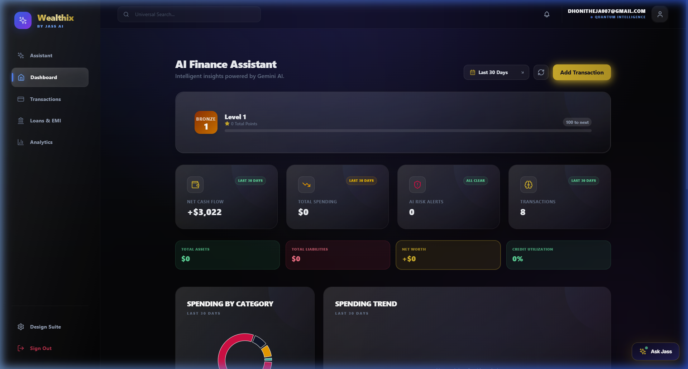
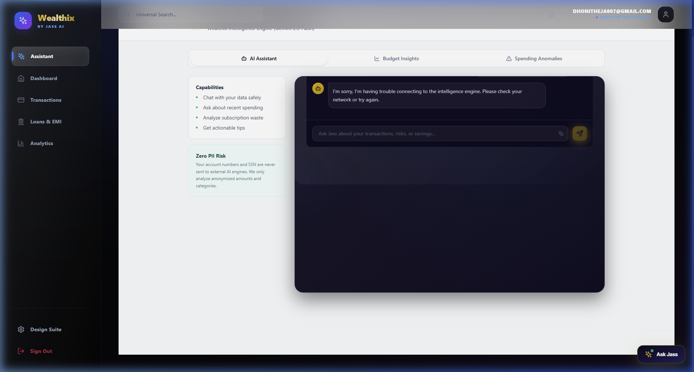
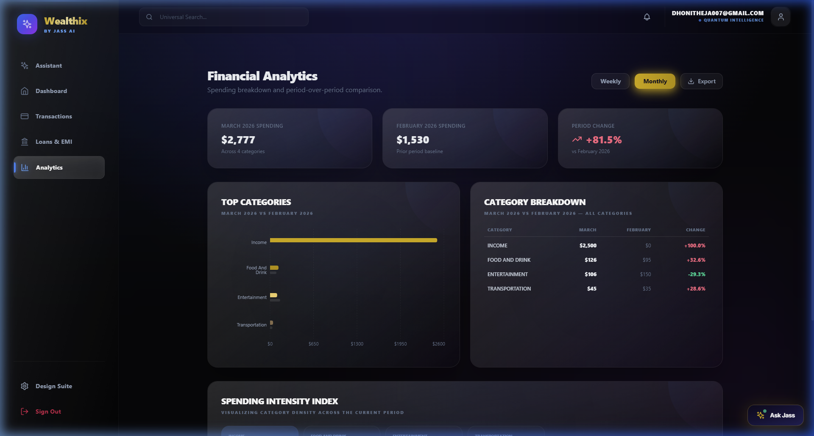
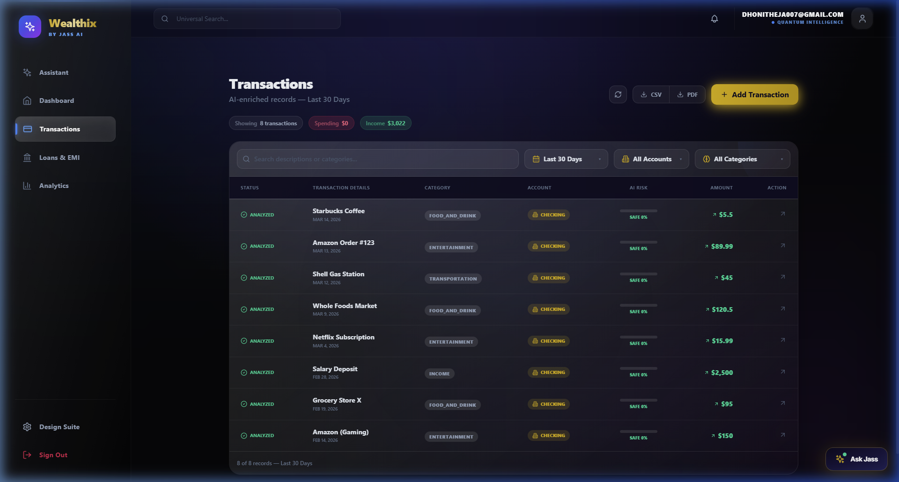
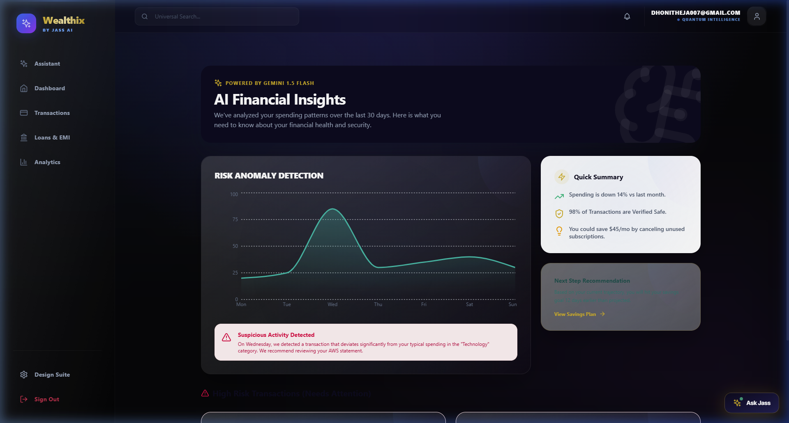
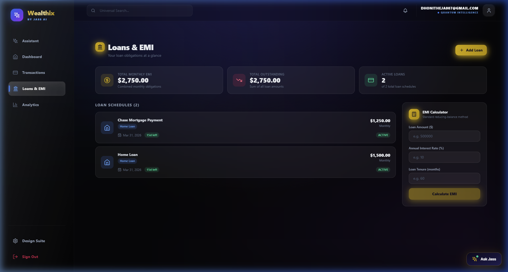
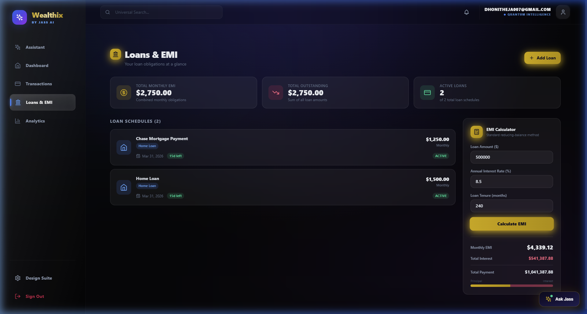

# 🌌 Wealthix: AI-Powered Financial Intelligence

> **Intelligent Wealth Management. Redefined.**

Wealthix is a high-performance, next-generation financial intelligence platform that merges traditional banking with generative AI. It empowers users to synthesize their financial footprint, interact with advanced AI-driven analytics, and uncover wealth-building insights through a premium, quantum-intelligent interface.

---

## ✨ Features Showcase

### 📊 Intelligent Dashboard
Monitor your **Net Worth**, **Cash Flow**, and **Spending Velocity** in real-time. Our dashboard provides a 360-degree view of your financial health with beautiful, interactive visualizations.



### 🤖 AI Financial Assistant (Jass)
Integrated with **Google Gemini 1.5**, Jass is your personal financial quant. Ask complex questions about your spending, get savings recommendations, or forecast your future net worth.



### 📈 Precision Analytics
Deep-dive into your spending patterns with period-over-period comparisons. Understand exactly where your money goes with granular category breakdowns and trend indices.



### 🛡️ Risk & Fraud Detection
Every transaction is passed through our AI risk engine, assigning a safety score and providing context on potential anomalies or suspicious Merchant activities.



### 🎯 Financial Insights & Health
Get a algorithmic health score based on your spending habits, debt-to-income ratio, and savings rate. Receive proactive insights to optimize your path to financial freedom.



### 🏦 Auto EMI & Loan Management
Take control of your debt with our intelligent loan hub. Automate repayments, track outstanding balances, and use our reducing-balance calculator to forecast your financial freedom.





---

## 🛠️ Technical Architecture

Wealthix is built on a resilient, decoupled microservices architecture designed for scale and security.

- **Frontend (`wealthix-ui`)**: Next.js 14, React, TypeScript, Tailwind CSS, Recharts, Framer Motion.
- **Core API (`wealthix-api`)**: Java 23, Spring Boot 3.2.x, Spring Security, JWT, PostgreSQL, Plaid SDK.
- **AI Intelligence (`financial-ai-service`)**: Python 3.11, FastAPI, Google Gemini 1.5 Flash, Pydantic.
- **Infrastructure**: Docker, Flyway (DB Migrations), JUnit 5, Pytest.

---

## 🚀 Getting Started

Ensure you have **Java 21+**, **Node.js 18+**, and **Python 3.10+** installed.

### 1. Database Setup
The system uses PostgreSQL. Configurations are managed in `wealthix-api/src/main/resources/application-dev.yml`.

### 2. Launch Backend API
```bash
cd wealthix-api
./mvnw clean install
./mvnw spring-boot:run
```
*API runs on `http://localhost:8080`*

### 3. Launch AI Service
```bash
cd financial-ai-service
pip install -r requirements.txt
uvicorn app.main:app --host 0.0.0.1 --port 8000
```
*AI service runs on `http://localhost:8000`*

### 4. Launch Frontend
```bash
cd wealthix-ui
npm install
npm run dev
```
*UI runs on `http://localhost:3000`*

---

## 🔒 Security Baseline

- **Bank-Grade Encryption**: Sensitive Plaid tokens are stored using **AES-256-GCM** encryption.
- **Isolated AI Context**: No PII (emails, names) is ever transmitted to the LLM. Only masked transaction metadata is used for analysis.
- **Stateless Auth**: Secured via HTTP-only JWT cookies with CSRF protection and 2FA support.

---

## 🏆 Gamification & Levels
Wealthix turns financial management into a game. Earn XP for staying under budget, identifying fraudulent transactions, and hitting savings goals. Progress through tiers from **Bronze** to **Diamond**.

---


